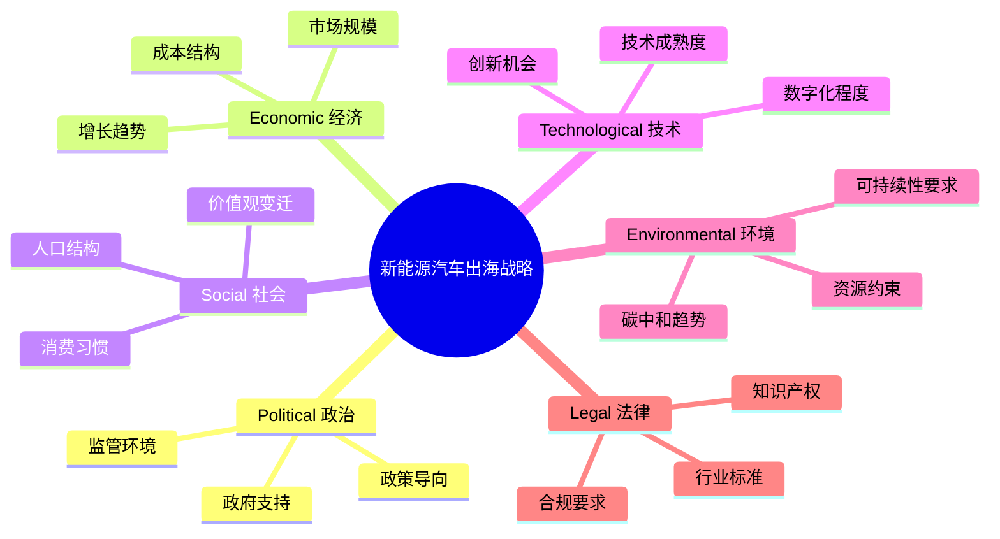
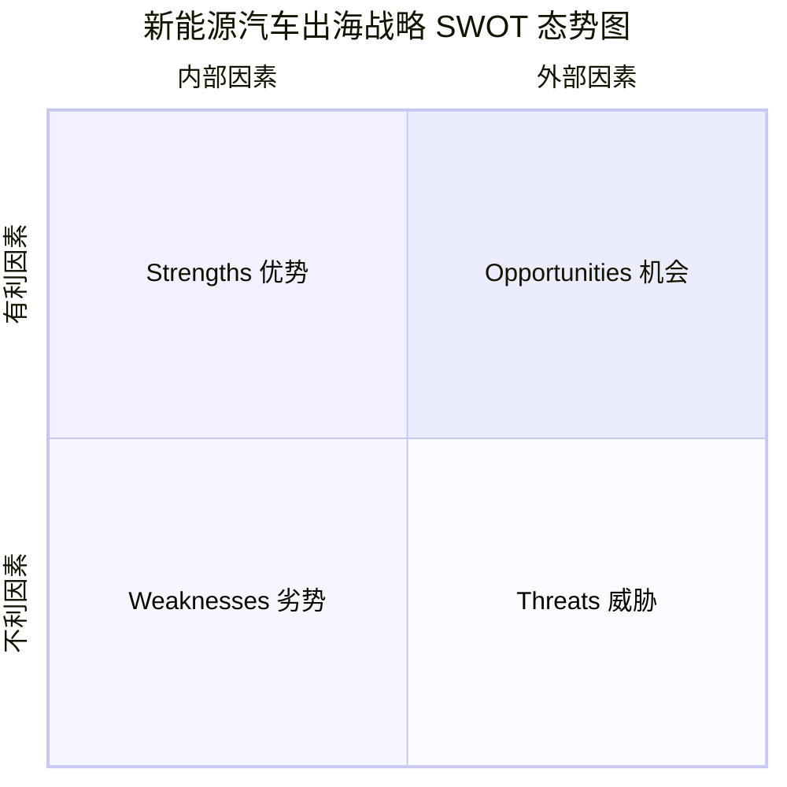
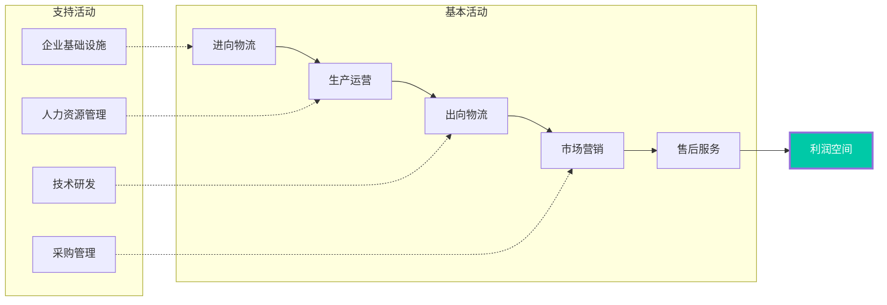
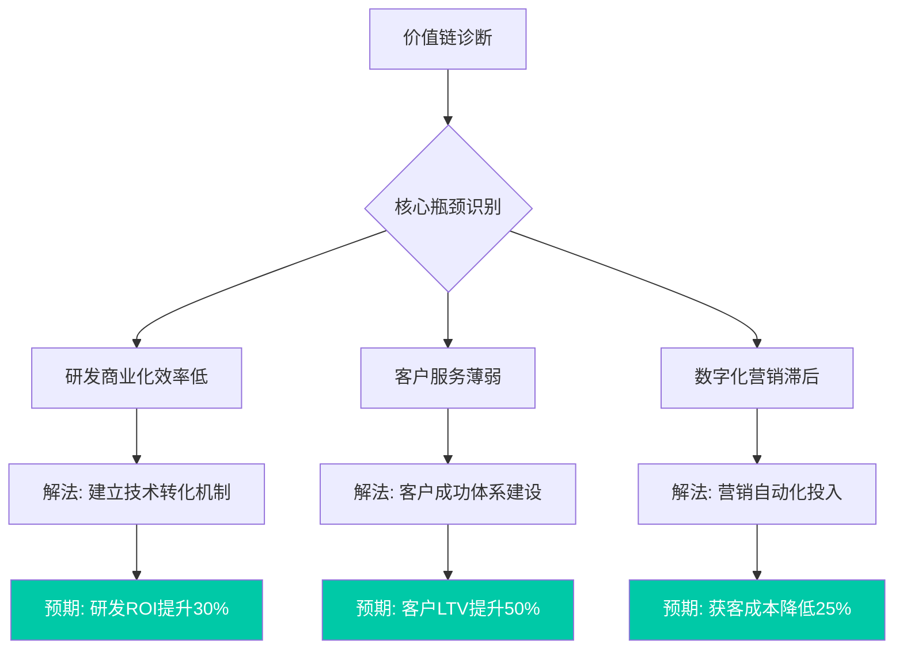
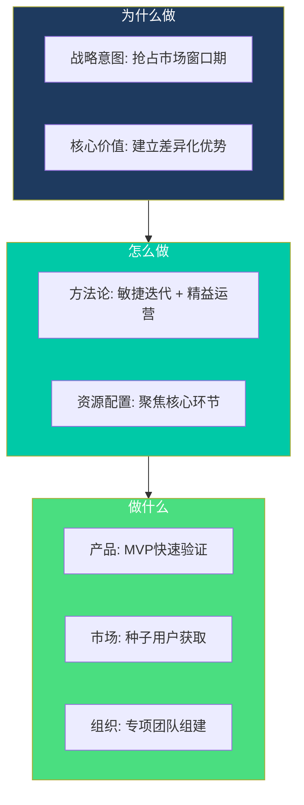
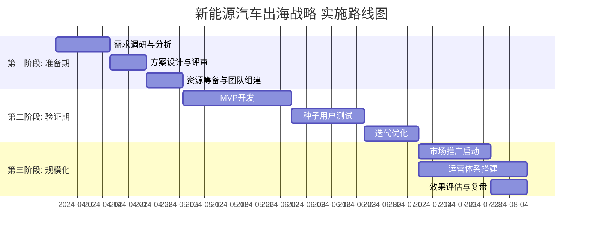

# 战略诊断报告：新能源汽车出海战略

 

| **Report Date** | **Methodology** | **Frameworks Applied** |
|-----------------|-----------------|------------------------|
| 2026-03-20 | MECE + Pyramid Principle | PESTEL | SWOT | Value Chain | 5W2H |

 

## 方法论说明

将综合运用 **PESTEL**、**SWOT**、**价值链** 和 **5W2H** 框架为您全方位诊断 新能源汽车出海战略。

**底层逻辑**：本报告严格遵循 **MECE 原则**（不重叠、不遗漏）和 **金字塔原理**（结论先行），确保分析的完整性和逻辑严密性。

---

## 宏观环境深度扫描：六维度解构 新能源汽车出海战略 的外部驱动力

### PESTEL 分析框架

 

### 六维度深度分析

| 维度 | 关键因素 | 影响评估 | 机会/威胁 |
|------|----------|----------|-----------|
| **P** 政治 | 政策支持力度加大，监管趋于规范化 | ●●● | 🚀 机会 |
| **E** 经济 | 市场进入成熟期，增速放缓但规模可观 | ●●○ | ⚠️ 双刃剑 |
| **S** 社会 | 消费升级趋势明显，年轻群体成为主力 | ●●● | 🚀 机会 |
| **T** 技术 | 数字化转型加速，AI应用场景扩展 | ●●● | 🚀 机会 |
| **E** 环境 | 可持续发展成为刚需，绿色溢价显现 | ●●○ | 🚀 机会 |
| **L** 法律 | 合规成本上升，但利好头部企业 | ●○○ | ⚠️ 双刃剑 |

> **Executive Insight:** 从 PESTEL 六维度分析，新能源汽车出海战略 面临的外部环境整体向好，技术变革和社会变迁是最大的结构性机会，需重点关注政策和合规的边际变化。

## 战略态势诊断：新能源汽车出海战略 的 SWOT 全景扫描

### 核心结论（金字塔原理 - 结论先行）

**新能源汽车出海战略 处于「攻守兼备」的战略态势**：内部优势突出但存在结构性短板，外部机会大于威胁但需警惕竞争升级。

 

### SWOT 矩阵可视化

 

### 优势分析 Strengths

| 指标 | 优势项 | 重要度 |
|------|--------|--------|
| ✅ | 核心技术壁垒深厚 | ●●● |
| ✅ | 品牌认知度领先 | ●●● |
| ✅ | 供应链整合能力强 | ●●○ |
| ✅ | 人才储备充足 | ●●○ |

 

### 劣势分析 Weaknesses

| 指标 | 劣势项 | 紧迫度 |
|------|--------|--------|
| ⚠️ | 国际化经验不足 | ●●● |
| ⚠️ | 产品线过于集中 | ●●○ |
| ⚠️ | 数字化转型滞后 | ●●○ |
| ⚠️ | 组织效率有待提升 | ●○○ |

 

### 机会分析 Opportunities

| 指标 | 机会项 | 吸引力 |
|------|--------|--------|
| 🚀 | 下沉市场空间巨大 | ●●● |
| 🚀 | 政策红利持续释放 | ●●● |
| 🚀 | 新技术应用场景拓展 | ●●○ |
| 🚀 | 跨界合作机会涌现 | ●●○ |

 

### 威胁分析 Threats

| 指标 | 威胁项 | 风险度 |
|------|--------|--------|
| 🔴 | 头部竞争加剧 | ●●● |
| 🔴 | 原材料价格波动 | ●●○ |
| 🔴 | 人才竞争白热化 | ●●○ |
| 🔴 | 监管政策不确定性 | ●○○ |

 

### SWOT 战略组合矩阵

| 战略类型 | 组合逻辑 | 推荐策略 | 优先级 |
|----------|----------|----------|--------|
| **SO 增长型** | 优势 × 机会 | 利用核心优势抢占下沉市场 | ⭐⭐⭐ |
| **WO 扭转型** | 劣势 × 机会 | 借政策红利加速数字化转型 | ⭐⭐ |
| **ST 多元型** | 优势 × 威胁 | 以技术壁垒构建竞争护城河 | ⭐⭐ |
| **WT 防御型** | 劣势 × 威胁 | 补齐国际化短板，分散风险 | ⭐ |

> **Executive Insight:** 建议 新能源汽车出海战略 采取「SO 增长型」战略为主线，同步推进「WO 扭转型」战略补齐数字化短板。核心优势与市场机会的结合点在下沉市场的快速渗透。

## 价值创造解构：新能源汽车出海战略 价值链深度诊断

### 价值链架构图

 

### 价值活动诊断矩阵

| 活动环节 | 当前成熟度 | 价值贡献 | 改进空间 | 优先级 |
|----------|------------|----------|----------|--------|
| **研发创新** | ●●● | 35% | 技术商业化效率 | ⭐⭐⭐ |
| **采购供应** | ●●○ | 15% | 供应商协同深度 | ⭐⭐ |
| **生产制造** | ●●● | 20% | 智能化升级 | ⭐⭐ |
| **物流配送** | ●●○ | 10% | 最后一公里效率 | ⭐ |
| **市场销售** | ●●○ | 15% | 数字化营销 | ⭐⭐⭐ |
| **客户服务** | ●○○ | 5% | 全生命周期运营 | ⭐⭐⭐ |

 

### 价值链优化路径

> **Executive Insight:** 新能源汽车出海战略 的价值链存在「微笑曲线两端薄弱」的典型问题——研发商业化和客户服务是最大的价值泄漏点。建议优先投资客户成功体系，预期可带来 50%+ 的客户 LTV 提升。

## 行动方案落地：新能源汽车出海战略 的 5W2H 执行矩阵

### Golden Circle 战略逻辑（Why-How-What）

 

### 5W2H 责任矩阵

| 维度 | 问题 | 定义 |
|------|------|------|
| **What** | 做什么 | 完成 新能源汽车出海战略 的全周期落地 |
| **Why** | 为什么 | 抓住市场窗口期，建立先发优势 |
| **Who** | 谁负责 | 战略PMO + 业务单元联合作战 |
| **When** | 何时完成 | Q1-Q2 MVP验证，Q3-Q4 规模化 |
| **Where** | 在哪里 | 一线城市试点 → 全国推广 |
| **How** | 怎么做 | 敏捷迭代，双周sprint，月度复盘 |
| **How Much** | 投入多少 | 预算: 500万；人力: 15人专项团队 |

 

### 甘特图：关键里程碑

 

### 风险与应对预案

| 风险类型 | 风险描述 | 概率 | 影响 | 应对策略 |
|----------|----------|------|------|----------|
| **执行风险** | 团队协同效率不足 | ●●○ | ●●● | 建立日站会机制，强化信息透明 |
| **市场风险** | 竞品快速跟进 | ●●● | ●●○ | 加速MVP验证，缩短上市时间 |
| **资源风险** | 预算超支 | ●○○ | ●●○ | 分阶段投入，设置止损线 |
| **技术风险** | 技术方案可行性 | ●●○ | ●●● | 提前POC验证，预留技术缓冲 |

> **Executive Insight:** 新能源汽车出海战略 的核心成功因素是「速度」——必须在竞品反应前完成 MVP 验证并锁定种子用户。建议将整体时间压缩 20%，采用「战时机制」推进。

## 附录

### 方法论说明

| 框架 | 用途 | 本报告应用 |
|------|------|------------|
| MECE | 确保分析完整性 | 全文贯穿 |
| 金字塔原理 | 结论先行，逻辑清晰 | 每节开头 |
| PESTEL | SWOT | Value Chain | 5W2H | 专项分析 | 主体内容 |

### 免责声明

本报告基于公开信息和行业经验生成，仅供决策参考。具体战略制定需结合企业实际情况。

---

*Generated by SocialHub.AI Consulting Report Generator v3.0*

*Methodology: MECE + Pyramid Principle | Frameworks: PESTEL, SWOT, Value Chain, 5W2H*
