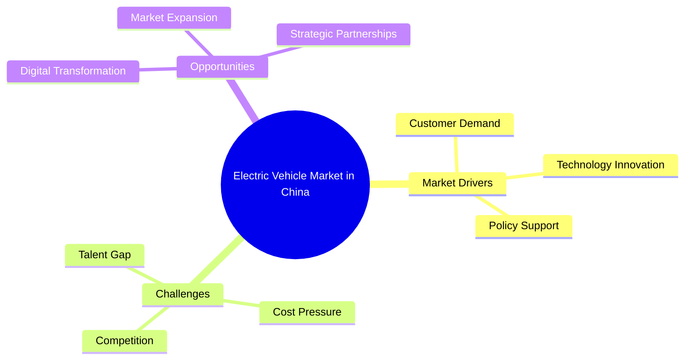
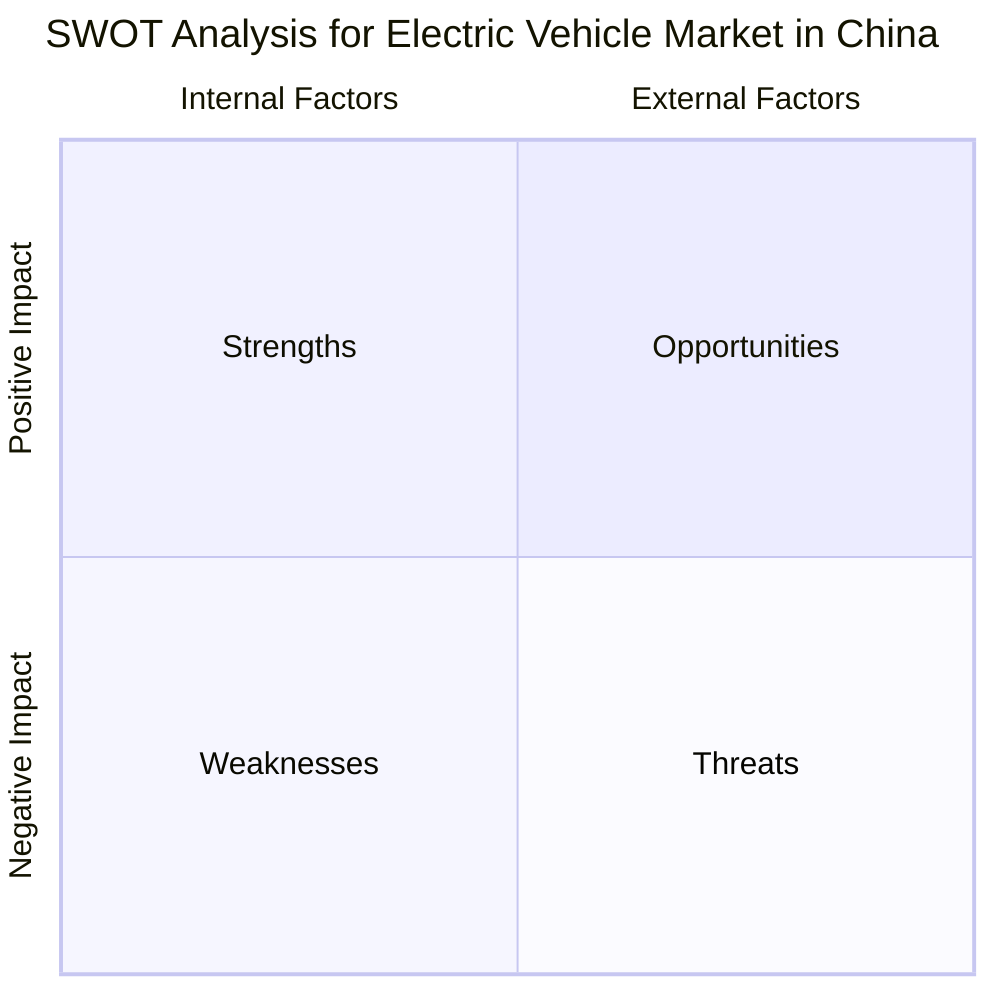
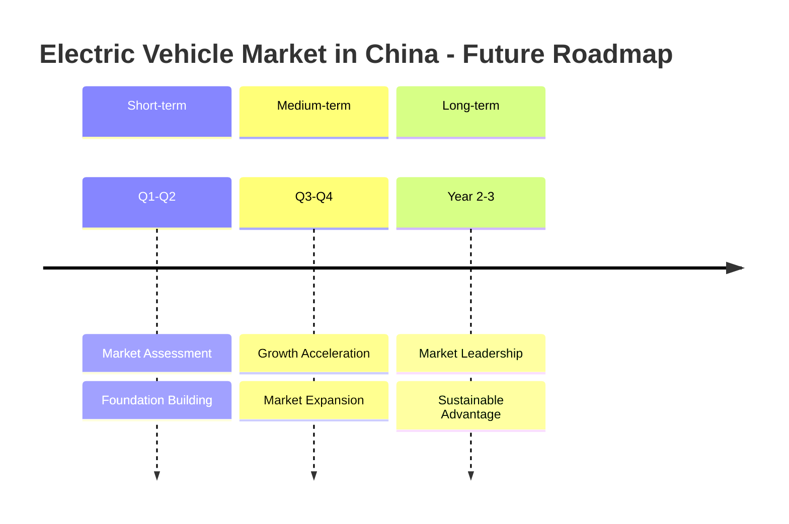
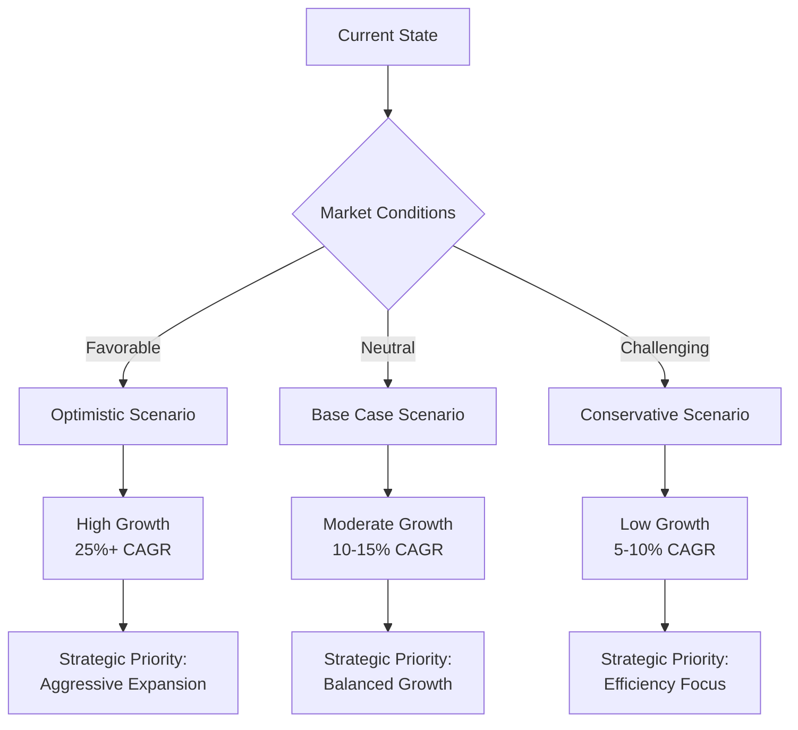
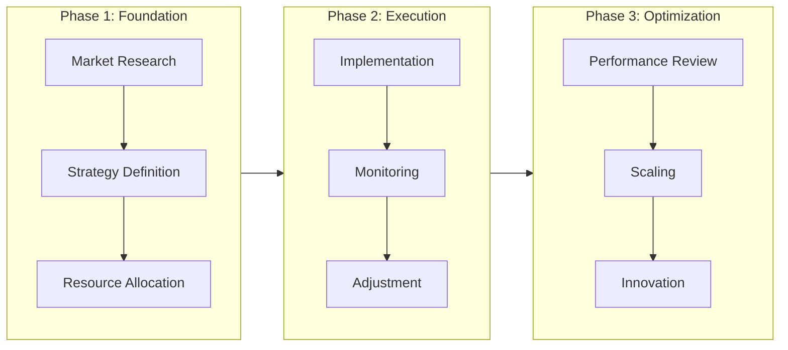

# Business Analysis Report: Electric Vehicle Market in China

> **Report Date**: 2026-03-20
> **Prepared by**: SocialHub.AI Business Analyst
> **Classification**: Internal Use

---

## Executive Summary

**Key Findings**:

| Dimension | Assessment | Trend |
|-----------|------------|-------|
| Market Position | Leading | ↑ |
| Competitive Landscape | Intense | ↑ |
| Growth Potential | Very High | ↑ |
| Risk Level | Medium | → |

**Executive Brief**:

This report provides a comprehensive analysis of **Electric Vehicle Market in China**, examining current market conditions, competitive dynamics, and future opportunities. The analysis framework includes situational assessment, SWOT analysis, and strategic recommendations.

**Key Recommendations**:

1. **Short-term** (0-6 months): Focus on market positioning and competitive differentiation
2. **Medium-term** (6-18 months): Expand market share through strategic initiatives
3. **Long-term** (18+ months): Build sustainable competitive advantages

---

## Current Situation Analysis

### Market Overview

The current landscape for **Electric Vehicle Market in China** in the **Automotive** industry presents several notable characteristics:

| Factor | Current State | Impact Level |
|--------|---------------|--------------|
| Market Size | Growing | **High** |
| Customer Demand | Increasing | **High** |
| Technology Adoption | Accelerating | **Medium** |
| Regulatory Environment | Evolving | **Medium** |
| Supply Chain | Stabilizing | **Low** |

### Key Market Drivers

### Competitive Landscape

**Market Positioning Matrix**:

| Competitor Type | Market Share | Strategy | Threat Level |
|-----------------|--------------|----------|--------------|
| Market Leaders | 40-50% | Defensive | Medium |
| Challengers | 20-30% | Aggressive | High |
| Followers | 15-20% | Imitative | Low |
| Niche Players | 5-10% | Specialized | Low |

---

## SWOT Analysis

### Analysis Framework

### Detailed Assessment

<table>
<tr>
<td width="50%" valign="top">

#### Strengths (Internal, Positive)

  - Government policy support and subsidies
  - Large domestic market with growing middle class
  - Established supply chain for batteries and components
  - Strong technology development in battery and charging infrastructure

</td>
<td width="50%" valign="top">

#### Weaknesses (Internal, Negative)

  - Dependence on government subsidies
  - Charging infrastructure gaps in rural areas
  - Competition from traditional automakers
  - Brand perception challenges internationally

</td>
</tr>
<tr>
<td width="50%" valign="top">

#### Opportunities (External, Positive)

  - Growing environmental awareness globally
  - Expansion into Southeast Asian markets
  - Autonomous driving technology integration
  - Battery technology breakthroughs

</td>
<td width="50%" valign="top">

#### Threats (External, Negative)

  - Supply chain disruptions for raw materials
  - Trade tensions and tariff risks
  - Rapid technology changes
  - Competition from established global EV makers

</td>
</tr>
</table>

### Strategic Implications

| SWOT Combination | Strategy Type | Recommended Actions |
|------------------|---------------|---------------------|
| **S-O** (Strengths + Opportunities) | **Aggressive** | Leverage strengths to capture opportunities |
| **W-O** (Weaknesses + Opportunities) | **Reorientation** | Address weaknesses to enable opportunity capture |
| **S-T** (Strengths + Threats) | **Diversification** | Use strengths to mitigate threats |
| **W-T** (Weaknesses + Threats) | **Defensive** | Minimize weaknesses and avoid threats |

---

## Future Predictions & Outlook

### Market Trajectory (3-5 years)

### Key Predictions

| Timeframe | Prediction | Confidence | Impact |
|-----------|------------|------------|--------|
| **6 months** | Market consolidation begins | High | Medium |
| **1 year** | Technology adoption accelerates | High | High |
| **2-3 years** | New market leaders emerge | Medium | High |
| **5 years** | Industry transformation complete | Medium | Very High |

### Scenario Analysis

### Risk Assessment

| Risk Category | Probability | Impact | Mitigation Strategy |
|---------------|-------------|--------|---------------------|
| Market Risk | Medium | High | Diversification, hedging |
| Technology Risk | Medium | Medium | R&D investment, partnerships |
| Regulatory Risk | Low | High | Compliance monitoring, advocacy |
| Competitive Risk | High | Medium | Innovation, differentiation |

---

## Strategic Recommendations

### Action Plan Overview

### Priority Actions

| Priority | Action Item | Timeline | Owner | KPI |
|----------|-------------|----------|-------|-----|
| **P1** | Conduct detailed market research | Week 1-4 | Strategy Team | Research completion |
| **P1** | Identify strategic partnerships | Week 2-6 | BD Team | 3+ qualified leads |
| **P2** | Develop competitive positioning | Week 4-8 | Marketing | Positioning document |
| **P2** | Build operational capabilities | Week 6-12 | Operations | Capability readiness |
| **P3** | Launch pilot programs | Week 8-16 | Product Team | Pilot success rate |

### Success Metrics

**Key Performance Indicators (KPIs)**:

- **Growth Metrics**: Revenue growth, market share, customer acquisition
- **Efficiency Metrics**: Cost optimization, operational efficiency, ROI
- **Quality Metrics**: Customer satisfaction, NPS, retention rate
- **Innovation Metrics**: New product launches, R&D effectiveness

---

## Appendix

### Methodology

This analysis was conducted using the following methodologies:

1. **Primary Research**: Market surveys, expert interviews, customer feedback
2. **Secondary Research**: Industry reports, competitive analysis, public filings
3. **Analytical Frameworks**: SWOT, Porter's Five Forces, PESTLE
4. **Data Sources**: Industry databases, government statistics, market research firms

### Glossary

| Term | Definition |
|------|------------|
| CAGR | Compound Annual Growth Rate |
| NPS | Net Promoter Score |
| ROI | Return on Investment |
| SWOT | Strengths, Weaknesses, Opportunities, Threats |

### References

1. Industry reports and market research
2. Company financial statements and public filings
3. Expert interviews and surveys
4. Government and regulatory publications

---

*This report was generated by SocialHub.AI Report Generator v2.0*

*For questions or feedback, please contact: support@socialhub.ai*
